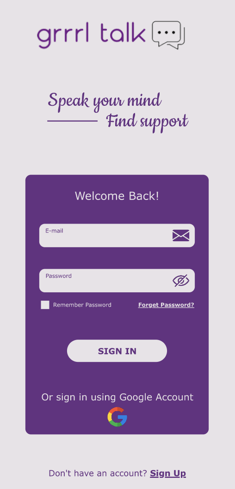

# Grrrl Talk - Fale o que pensa e encontre apoio.

## Índice

* [1. Resumo do Projeto](#1-resumo-do-projeto)
* [2. Histórias de usuário]
(#2-histórias-de-usuário)
* [3. Protótipos de baixa e alta fidelidade](#3-protótipos-de-baixa-e-alta-fidelidade)
* [4. Considerações gerais](#4-considerações-gerais)
* [5. Critérios de aceitação mínimos do
  projeto](#5-criterios-de-aceitação-mínimos-do-projeto)
* [6. Hacker edition](#6-hacker-edition)
* [7. Entrega](#7-entrega)
* [8. Guias, dicas e leituras
  complementares](#8-guias-dicas-e-leituras-complementares)

***

## 1. Resumo do Projeto

##### Aqui vem uma descricao geral

- Qual é a necessidade a Grrrl Talk busca resolver? E para quem?

- Como a Grrrl Talk está resolvendo os problemas das usuárias?

---
## 2. Histórias de usuário
- Form pesquisa com o usuário
- HU #1 e respectivas definicões de pronto
- HU #2 
- HU #3 
- HU #4
## 3. Protótipos de baixa e alta fidelidade

- Versão Mobile - Alta fidelidade

  
  
- Versão Mobile - Baixa fidelidade
- Versão Desktop - Alta fidelidade
- Versão Desktop - Baixa fidelidade
