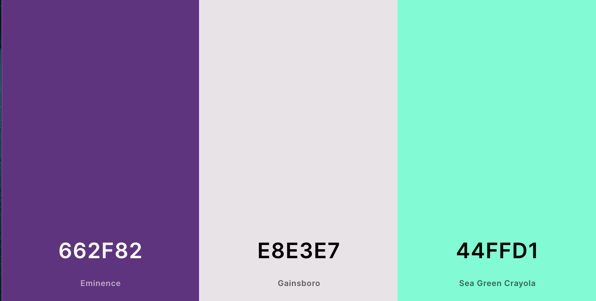

# Grrrl Talk - Fale o que pensa e encontre apoio

## Índice

- [Grrrl Talk - Fale o que pensa e encontre apoio](#grrrl-talk---fale-o-que-pensa-e-encontre-apoio)
  - [Índice](#índice)
  - [1. Resumo do Projeto](#1-resumo-do-projeto)
  - [2. Histórias de usuário](#2-histórias-de-usuário)
  - [3. Protótipos](#3-protótipos)
  - [4. Critérios de aceitação](#4-critérios-de-aceitação)
  - [5. Teste de usabilidade](#5-teste-de-usabilidade)
  - [6. Melhorias futuras](#6-melhorias-futuras)
  - [7. Linguagens e ferramentas utilizadas](#7-linguagens-e-ferramentas-utilizadas)
  - [8. Sobre as desenvolvedoras](#8-sobre-as-desenvolvedoras)
  
***

## 1. Resumo do Projeto

- A Grrrl Talk surgiu da necessidade em ter um ambiente seguro e livre de assédio e/ou comentários misóginos. O app, exclusivo para mulheres, visa fortalecer nossa rede de apoio mútuo ao compartilhar e acolher histórias.

- Qual a necessidade a Grrrl Talk busca resolver? E para quem?
  Pensando no assédio e agressões, com raízes misóginas infelizmente comuns e conhecidos por todas as mulheres, sofrido nos espaços virtuais, esta aplicação busca servir como um espaço seguro e exclusivo para mulheres, para trocas de histórias, desabafos e demais experiências.

- Como a Grrrl Talk está resolvendo os problemas das usuárias?
  Ao fornecer um espaço livre de proconceitos e julgamentos, o aplicativo promove a conexão entre mulheres que buscam compartilhar suas vivências, encontrar apoio e também acolher outras histórias.

---

## 2. Histórias de usuário

- Formulário aplicado:
  
  
   

- HU #1: Gostaria de me cadastrar e, em seguida, fazer login com meu email.
   
   1. Critérios de aceitação: a usuária deverá ter opcões de ingressar numa conta existente ou criar cadastro; Para criar conta será necessário um usarname, email e senh; para fazer login será necessário email e senha.
   2. Definições de pronto: criar página de registro e de login com seus respectivos js; criar funcões que interajam com o Firebase, que cadastre e armazene dados da nova usuária.
   
  
- HU #2: Gostaria de publicar um post e ter a opção de editar e/ou removê-lo.
   
  1. Critérios de aceitação: a usuária deve conseguir postar o que deseja e fazer as edicões que deseja.
  2. Definições de pronto: criar um painel que contenha uma área de texto e um botão que submeta o post; criar uma funcao que interaja com o Firebase que armazene os dados da publicacao no banco de dados, numa coleçao, e que devolva essas publicaçoes quando requisitado.
   
- HU #3: Gostaria de dar like nas publicações
   
  1. Critérios de aceitação: a usuária poderá dar like ou remover o seu like.
  2. Definições de pronto: criar uma função de dar like e que também remova; que essa função conte os likes numa publicação; que as alterações (acréscimo ou remoção do like) sejam atualizadas na coleção posts do Firebase.
   
- HU #4: Gostaria de fazer logout
   
  1. Critérios de aceitação: a usuária poderá encerrar sua sessão.
  2. Definições de pronto: criar uma funcão de logout e que mude o estado da usuária.

## 3. Protótipos

- <a href="https://xd.adobe.com/view/b0dbbbfa-b976-4c6f-92ec-8157f5996765-e588/">Veja as telas pelo AdobeXd </a>
  
- Versão Mobile - Alta fidelidade

  
  

- Versão Desktop - Alta fidelidade
  
  
  

- Versão Mobile - Baixa fidelidade
- Versão Desktop - Baixa fidelidade
- Paleta de cores:
  
   

## 4. Critérios de aceitação

- Ser uma SPA.
- Ser responsivo.
- Receber revisão de código da equipe.
- Fazer testes unitários.
- Fazer testes manuais buscando erros e imperfeições simples.
- Fazer testes de usabilidade e incorporar o feedback dos usuários como melhorias.
- Fazer deploy do aplicativo e marcar a versão (git tag).

## 5. Teste de usabilidade

## 6. Melhorias futuras

- Editar e/ou remover comentários
- Visitar outros perfis
- Compartilhamento de posts

## 7. Linguagens e ferramentas utilizadas

1. CritériosHTML e CSS

- HTML semântico
- CSS flexbox
  
2. DOM e Web APIs

- Manipulação do DOM
- History API
- sessionStorage

3. Javascript

- Uso de callbacks
- Consumo de Promises
- Uso de ES modules (import | export)

4. Firebase

- Firestore
- Firebase Auth
- Firebase security rules
- Uso de onSnapshot | onAuthStateChanged

5. Testing

- Teste unitários
- Testes assíncronos
- Mocking

6. Git e Github

- Colaboração pelo Github
- Organização pelo Github

7. Boas práticas de programação

- Modularização
- Nomenclatura / Semântica
- Linting

## 8. Sobre as desenvolvedoras
💜 Feito com muito carinho por Amanda Gusmão e Layssa Aragão: 

⚡️Layssa Aragão <a href="https://www.linkedin.com/in/layssaaragaob/">Linkedin</a> | <a href="https://github.com/aragaolala">GitHub</a>
⚡️Amanda Gusmão <a href="https://www.linkedin.com/in/gusmaoamanda/">Linkedin</a> | <a href="https://github.com/amandagusmao">GitHub</a>
